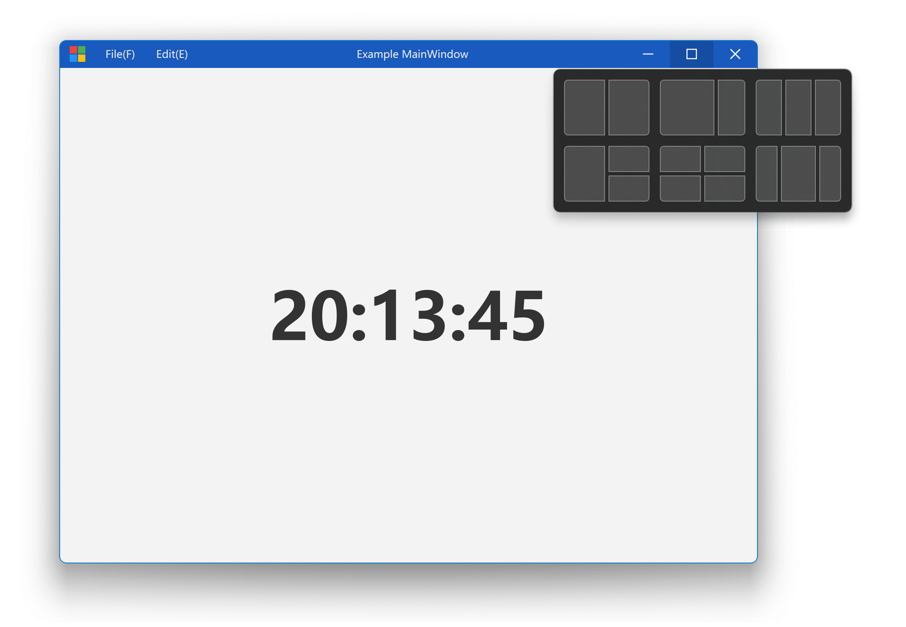
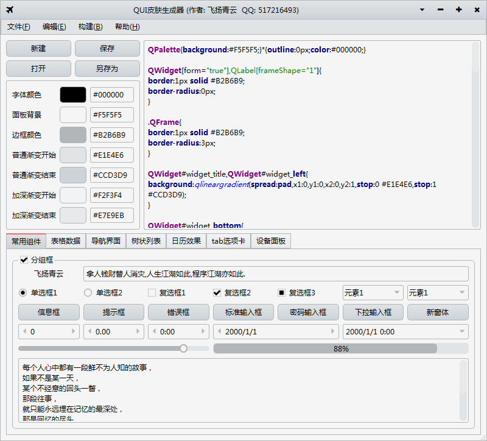

QT/设计/动效合集
===============

## 组件

### 按钮类

#### 纯线按钮
完全使用线条组成前景的按钮。

传入坐标与颜色，实时绘制 n 根线条，每一个显示效果之间的切换都带有干净利落的非线性动画变换效果。

https://github.com/Qt-Widgets/Qt-PurelinButton-Animated-Button-Morph

### 加载类

## 窗口

### 无边框窗口

Cross-platform frameless window framework for Qt. Support Windows, macOS, Linux.

https://github.com/stdware/qwindowkit

## QPainter 示例

https://github.com/Qt-Widgets/EasyQPainter

## 其他
### Qt 皮肤编辑器

### 动效合集

https://github.com/iwxyi/Qt-ShowyWidgets

## Qt 大佬

刘典武 - https://github.com/feiyangqingyun
PyQt5 代码笔记 - ttps://github.com/muziing/PyQt_practice